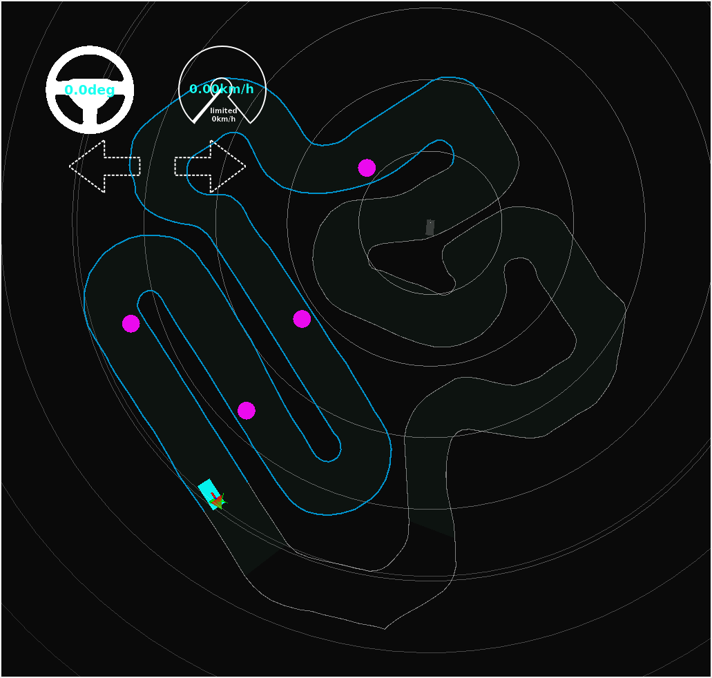
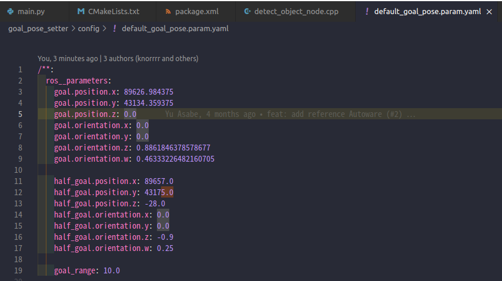

## detect_object_nodeを作成して、動かしてみた気づき
- 作ったもの
https://github.com/shrimp-f/aichallenge-2024/blob/develop/simple_object_avoidance/aichallenge/workspace/src/aichallenge_submit/simple_object_avoidance/src/detect_object_node.cpp

- 自己位置の5m以内に障害物があったら、その障害物が右側か左側を検出する機能を作ってみました
    - 1が左、2が右、障害物がない場合は0が出る
    - 動かしてみたところ、左側にあるのに右側と出たりした。バグがあると思われます。

- 10mなどで障害物の接近を見ると、コースの壁を超えた反対側の障害物も検知してしまった
    - 経路上の近くの障害物を検知するように修正したほうが性能が上がりそうです


## goal_pose_setterに関する気づき
### わかったこと
- goal_pose_setterが、rvizで見えている緑色の経路の終端(goal)を配置しています。default_goal_pose.param.yamlがデフォルトの2箇所のゴールを設定しているファイルでした。

### やってみたこと
- default_goal_pose.param.yamlのgoalをピットの位置にしました。

#### pitの位置
```
pose:
  pose:
    position:
      x: 89626.984375
      y: 43134.359375
      z: 0.0
    orientation:
      x: 0.0
      y: 0.0
      z: 0.8861846378578677
      w: 0.46333226482160705
```

※rvizの「2D Pose Estimate」ボタンを押して、経路上をクリックして方向を合わせると、クリックした場所の位置情報がros2トピックで出てきます。他のターミナルで「ros2 topic echo /initialpose」とすると、その位置情報がわかります。

### やってみてわかったこと
- ピットの位置にしたら、緑色の経路が生成されませんでした



### つぎにやりたいこと
- default_goal_pose.param.yamlをもとに、goalの数を増やして、ピットも追加する