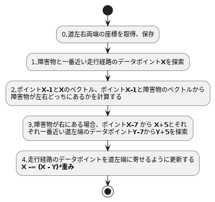

# 概要
path_to_trajectoryモジュールはもともとデータフォーマット変換（ PathWithLaneId -> Trajectory ）しているだけのモジュール。
このモジュールをpythonに書き換えて、障害物避けの機能を追加を試している。

# 入力Topic

| トピック | 概要 |
----|---- 
| /planning/scenario_planning/lane_driving/behavior_planning/path_with_lane_id | 走行経路の座標、道左右端の座標 |
| /aichallenge/objects | （追加）障害物の情報 |

# その他入力

| ファイル | 概要 |
----|---- 
| center_lane_line.csv | 現状の走行車線の座標（完全に中央になっていない） |
| fixed_center.csv | 現状の走行車線を完全に中央になるように修正したもの |
| out_lane_bound.csv | 道左端の座標 |
| center_lane_line.csv | 道右端の座標 |

# 出力Topic

| トピック | 概要 |
----|---- 
| /planning/scenario_planning/trajectory | 走行経路の座標 |

# 障害物避け
入力の走行経路の座標、道左右端の座標と障害物の座標をもとに、障害物避けるように走行経路を経路し直します。以下は一個の障害物を避ける処理フロー。



対象のコードは「aichallenge-2024/aichallenge/workspace/src/aichallenge_submit/path_to_trajectory/path_to_trajectory/path_to_trajectory_node.py」にある

### 0,道左右両端、中央の座標をcsvファイルから読み込む
ファイルパスがもっといい方法でかけれないかを調査中
``` python
with open('/aichallenge/workspace/install/path_to_trajectory/share/path_to_trajectory/data/out_lane_bound.csv') as f:
            lines = f.readlines()
            for line in lines[1:]:
                self.left_bound.append({"x":float(line.split(",")[0]),"y":float(line.split(",")[1])})
with open('/aichallenge/workspace/install/path_to_trajectory/share/path_to_trajectory/data/inner_lane_bound.csv') as f:
    lines = f.readlines()
    for line in lines[1:]:
        self.right_bound.append({"x":float(line.split(",")[0]),"y":float(line.split(",")[1])})
with open('/aichallenge/workspace/install/path_to_trajectory/share/path_to_trajectory/data/fixed_center.csv') as f:
    lines = f.readlines()
    for line in lines[1:]:
        self.center_line.append({"x":float(line.split(",")[0]),"y":float(line.split(",")[1])})
```


### １,道の中央の座標から障害物が左右どっちにあるかを計算
道の中央の座標と障害物のベクトルの内積を計算して、障害物が左右どっちにあるかを計算
``` python
# find nearest point in center line, then determin object is on right or left
distance_min = 100
point_min = -1
for i,point in enumerate(self.center_line):                
    dist = (point["x"] - object_x)**2 + (point["y"] - object_y)**2
    if(dist<distance_min):
        distance_min =dist
        point_min = i
if(point_min < 2):
    point_min = 2 # fix out of range problem
vx1 = self.center_line[point_min]["x"] - self.center_line[point_min-2]["x"]
vy1 = self.center_line[point_min]["y"] - self.center_line[point_min-2]["y"]
vx2 = object_x - self.center_line[point_min-2]["x"]
vy2 = object_y - self.center_line[point_min-2]["y"]
ans = vx1 * vy2 - vy1 * vx2
```

### ２,障害物と一番近い走行経路のデータポイント**X**を探索
すべての走行経路のデータポイントに対して、障害物との距離を比較している
```　python
# find nearest point in TrajectoryPoint() of object
distance_min = 100
point_min = -1
for i,point in enumerate(trajectory.points):                
    dist = (point.pose.position.x - object_x)**2 + (point.pose.position.y - object_y)**2
    if(dist<distance_min):
        distance_min =dist
        point_min = i
```


### 3,一番近い道左端のデータポイントを探索
障害物が右にある場合、ポイント**X-7** から **X+5**とそれ
ぞれ一番近い道左端のデータポイント**Y-7**から**Y+5**を探索。今は１３個のデータポイントを対象にしているが、調整は可能。

``` python
def find_nearest_point_in_boundary(self,trajectory_point: PathPoint,boundary, gain):
        distance_min = 100
        point_min = 1
        for i,data in enumerate(boundary):
            dist = (trajectory_point.pose.position.x - data.x)**2 + (trajectory_point.pose.position.y - data.y)**2
            if(dist<distance_min):
                distance_min =dist
                point_min = i
```

### 4,走行経路のデータポイントを道左端に寄せるように更新する
**X -= (X - Y)*重み**、データポイントごとに重みを調整することで、避け具合を調整することができ、経路を滑らかにする。

``` python
trajectory_point.pose.position.x -= (trajectory_point.pose.position.x - boundary[point_min].x)/(1.8+gain)
trajectory_point.pose.position.y -= (trajectory_point.pose.position.y - boundary[point_min].y)/(1.8+gain)
```