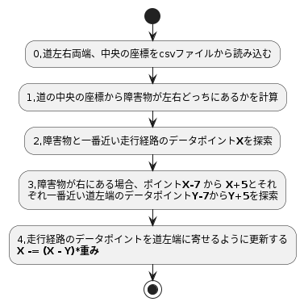

# 概要
path_to_trajectoryモジュールはもともとデータフォーマット変換（ PathWithLaneId -> Trajectory ）しているだけのモジュール。
このモジュールをpythonに書き換えて、障害物避けの機能を追加を試している。

# 入力Topic

| トピック | 概要 |
----|---- 
| /planning/scenario_planning/lane_driving/behavior_planning/path_with_lane_id | 走行経路の座標、道左右端の座標 |
| /aichallenge/objects | （追加）障害物の情報 |

# 出力Topic

| トピック | 概要 |
----|---- 
| /planning/scenario_planning/trajectory | 走行経路の座標 |

# 障害物避け
入力の走行経路の座標、道左右端の座標と障害物の座標をもとに、障害物避けるように走行経路を経路し直します。以下は一個の障害物を避ける処理フロー。



対象のコードは「aichallenge-2024/aichallenge/workspace/src/aichallenge_submit/path_to_trajectory/path_to_trajectory/path_to_trajectory_node.py」にある

### 0,道左右両端の座標を取得、保存（要改善）
path_with_lane_idから通知された道左右端の座標はコース全体ではなく、今後走行する予定部分だけとなる。
一周の座標をまるごと取得できるのが理想ですが、現状以下のような情報を無理やりつなぎ合わせている状況です。

- start point -> goal手前10mくらい
- goal手前10mくらい -> half goal手前10mくらい
- half goal手前10mくらい -> goal手前10mくらい

``` python
# get boundary at start
if(len(self.left_bound) == 0):
    self.left_bound = msg.left_bound # part of course ending is lost, fix me
    self.get_logger().info("left_bount_len: %s" % len(msg.left_bound))
if(len(self.right_bound) == 0):
    self.right_bound = msg.right_bound  # part of course ending is lost, fix me
    self.get_logger().info("right_bount_len: %s" % len(msg.right_bound))
# append boundary of goal -> start point, which is not showed at firts time , may be need fix
if( (len(msg.left_bound) == 2) & (self.first_round_flag == 0 ) ):
    self.first_round_flag = 1
if( (len(msg.left_bound) != 2) & (self.first_round_flag == 1 ) ):
    self.first_round_flag = 2
    self.left_bound += msg.left_bound[2:15]
    self.right_bound += msg.right_bound[2:15]
    self.get_logger().info("route merged")
```

### 1,障害物と一番近い走行経路のデータポイント**X**を探索
すべての走行経路のデータポイントに対して、障害物との距離を比較している
```　python
# find nearest point in TrajectoryPoint() of object
distance_min = 100
point_min = -1
for i,point in enumerate(trajectory.points):                
    dist = (point.pose.position.x - object_x)**2 + (point.pose.position.y - object_y)**2
    if(dist<distance_min):
        distance_min =dist
        point_min = i
```

### 2,障害物が左右どっちにあるかを計算
ポイント**X-1**と**X**のベクトル、ポイント**X-1**と障害物のベクトルの内積を計算して、障害物が左右どっちにあるかを計算
``` python
vx1 = trajectory.points[point_min].pose.position.x - trajectory.points[point_min-2].pose.position.x
vy1 = trajectory.points[point_min].pose.position.y - trajectory.points[point_min-2].pose.position.y
vx2 = object_x - trajectory.points[point_min-2].pose.position.x
vy2 = object_y - trajectory.points[point_min-2].pose.position.y  
ans = vx1 * vy2 - vy1 * vx2 # 内積＞０の場合が左
```

### 3,一番近い道左端のデータポイントを探索
障害物が右にある場合、ポイント**X-7** から **X+5**とそれ
ぞれ一番近い道左端のデータポイント**Y-7**から**Y+5**を探索。今は１３個のデータポイントを対象にしているが、調整は可能。

``` python
def find_nearest_point_in_boundary(self,trajectory_point: PathPoint,boundary, gain):
        distance_min = 100
        point_min = 1
        for i,data in enumerate(boundary):
            dist = (trajectory_point.pose.position.x - data.x)**2 + (trajectory_point.pose.position.y - data.y)**2
            if(dist<distance_min):
                distance_min =dist
                point_min = i
```

### 4,走行経路のデータポイントを道左端に寄せるように更新する
**X -= (X - Y)*重み**、データポイントごとに重みを調整することで、避け具合を調整することができ、経路を滑らかにする。

```
trajectory_point.pose.position.x -= (trajectory_point.pose.position.x - boundary[point_min].x)/(1.8+gain)
        trajectory_point.pose.position.y -= (trajectory_point.pose.position.y - boundary[point_min].y)/(1.8+gain)
```