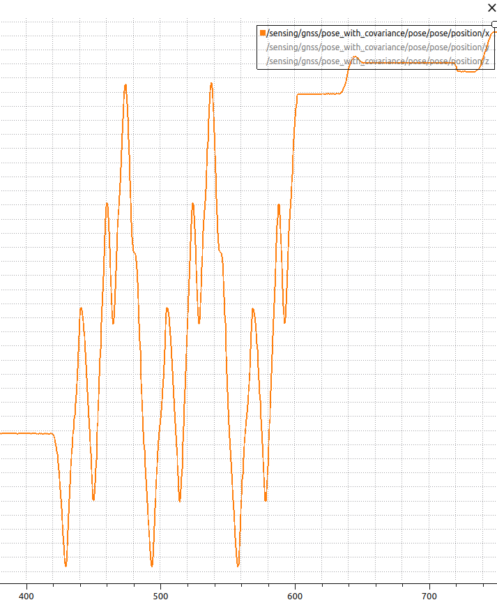
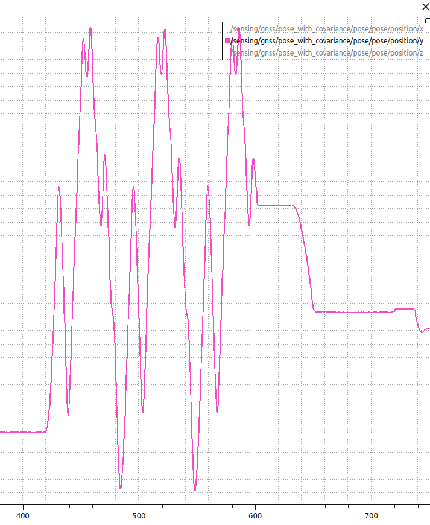
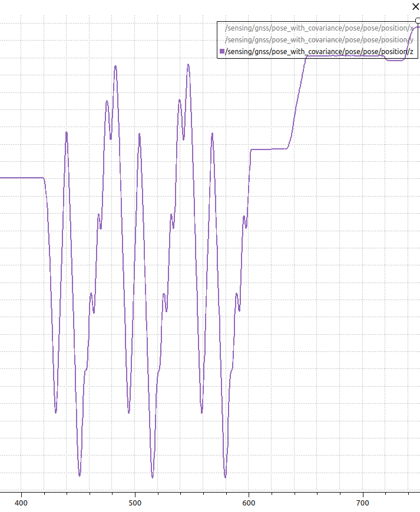
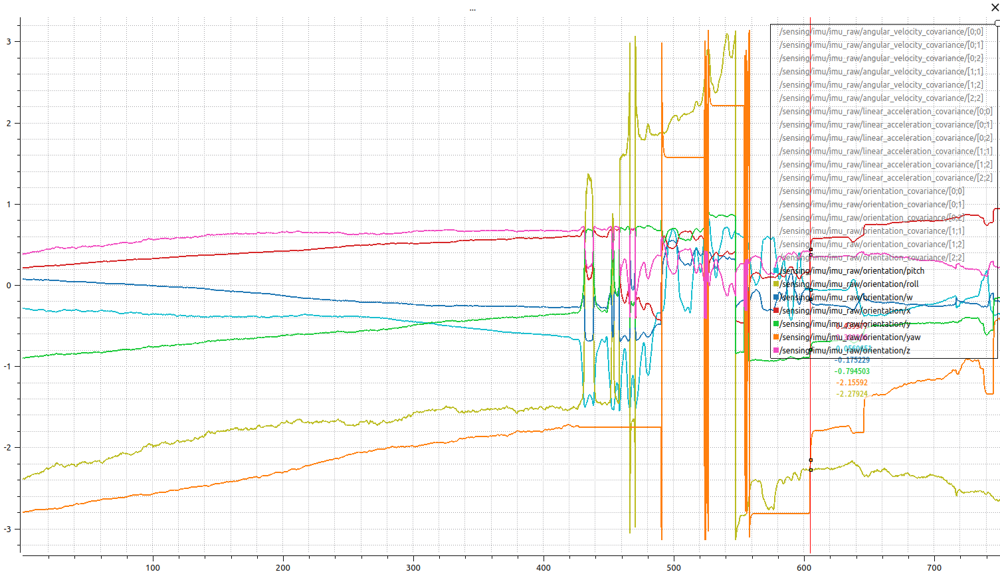
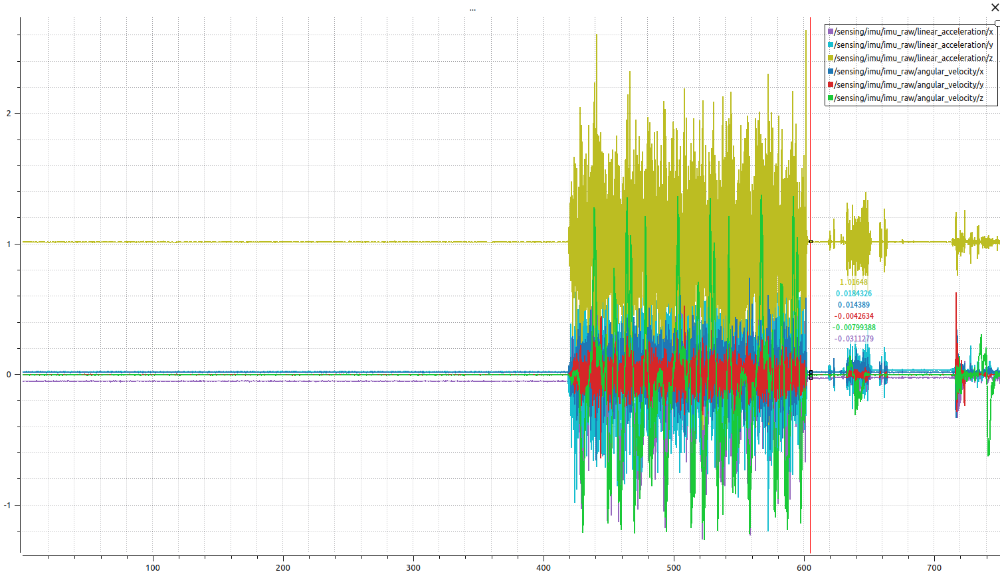
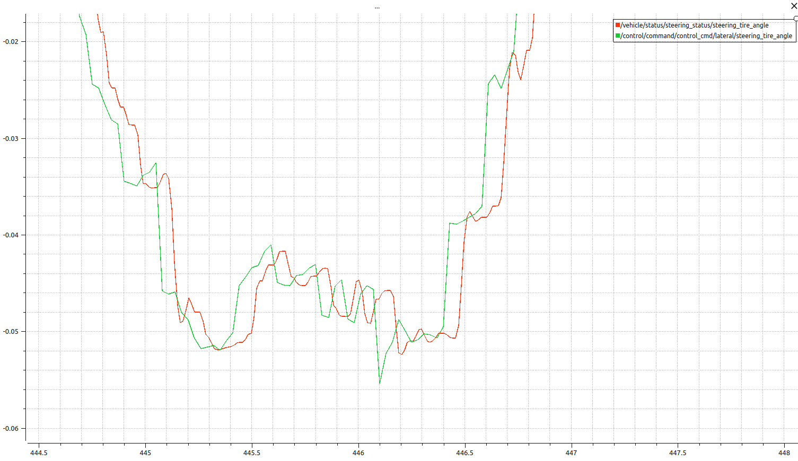

# 走行データ：0920_demo_interface_only　の調査

## 目的
前日の調査で、imu, gnssのあたりがよくわからなかったので、
実機データを、plotjugglerで表示してノイズの載り具合や、共分散値などを見てみる。

## わかったこと
- gnssにあまりノイズは含まれていないようだ。sensing/gnss/pose_with_covariance/pose/pose/x, y, z は正確なように見える。3周分きれいにノイズなく記録されている。

- 共分散は、covariance[7]だけにデータが入っていて、その値は下記の通りで、走行前後でステップ状に変化している。
  - 走行前は230前後
  - 走行中は、141くらい
  - 走行後は250くらいに上昇
- imuのデータについて
  - orientationには、ドリフトが含まれている。これが地磁気センサと言われていたもの？

  - linear_acceleration/x, y, z, angular_velocity/x, y, zはドリフトはない（オフセットはある）。これらの値をもとに拡張カルマンフィルタで、gnssのx, y, zを算出していると想定。その計算に、おそらく、0.5sほどかかっているのでしょう。

- タイムラグの調査
  - steering_tire_angleについて、vehicle/status/steering_status/steering_tire_angleと、/control/command/control_cmd/lateral/steering_tire_angleは、値のスケールは一致。0.1sほどの遅延がある(steering/status/steering_tire_angleのほうが遅い)。

  - controlcommand/control_cmd/longitudinal/accelerationと、/vehicle/status/velocity_status/longitudinal_velocityについても、スケールは一致。タイムラグはなさそう。実測値ではなぜだか、/vehicle/status/velocity_status/longitudinal_velocityの方が0.03sほど早いので、ログ出力箇所の差と想定。

## 考察
- 自己位置はgnssから取得したodometryデータをそのまま使えば良さそう。ただし、大きく異なる位置情報が来た場合は、何らかの異常があったものとして、低速走行に切り替えるのが良さそう。
- 速度検出については遅延はなさそうなので、実測値をそのまま自己位置推定に使える。（ちょっと腑に落ちない）
- 操舵については、実測値は0.1sの遅延がある。測定の遅延なのか、追従遅れなのか。波形は一致している（なまりがない）ので、一次遅れはなさそう。今日の調査からどちらの遅れかわからない。
  - 測定の遅延なら、自己位置推定には指令値が使える。
  - 追従遅れなら、自己位置推定には実測値が使える。